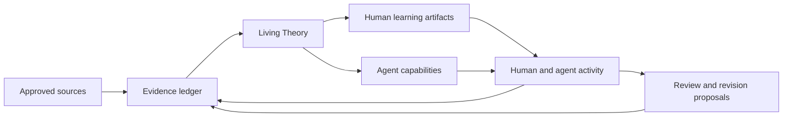

# Learning Foundry System Model

Learning Foundry creates an environment in which a human and an agent can learn from the same approved material without pretending that they understand it in the same way.

## The product loop

1. The user approves a local document or online source.
2. The source pipeline extracts bounded fragments with source locations.
3. Synthesis proposes concepts, claims, relationships, assumptions, boundaries, and questions.
4. Human approval records the accepted proposal as evidence.
5. The application rebuilds the Living Theory from that evidence.
6. The theory grounds learning artifacts for the human and capability proposals for the agent.
7. Predictions, responses, practical results, corrections, and failures append more evidence.
8. Later consolidation can propose revisions without deleting the history that produced them.

## What is canonical

The append-only evidence ledger is the canonical record. Sources remain canonical for what they actually say.

The Living Theory, understanding state, agent memory, review items, and capability state are projections. They can be rebuilt by replaying the ledger and therefore must not contain independently edited truth.

## Different epistemic states

Learning Foundry keeps these categories separate:

- **Source fact:** a claim grounded in an approved source location.
- **Human interpretation:** what the learner currently thinks or reports.
- **Agent synthesis:** a generated explanation, relationship, or proposal.
- **Hypothesis:** a prediction made before observing an outcome.
- **Practical observation:** a recorded result from applying or manipulating something.
- **Validated behavior:** a capability result that passed a declared evaluation.

Confidence does not turn an interpretation into a source fact. Successful agent execution does not prove human understanding. Generated synthesis does not activate a capability.

## The Living Theory

The Living Theory is the shared map between sources, human learning, and agent capabilities. It records purpose, concepts, relationships, decisions, assumptions, boundaries, contradictions, and unresolved questions with stable IDs and provenance.

It is living because new evidence can supersede an element while retaining its earlier version. It is a theory because it remains an inspectable, revisable interpretation rather than a replacement for the original sources.

## Human learning

The human-learning path currently has three complementary forms:

1. **Explainers** establish background, purpose, intuition, mechanism, details, and assumptions in a meaningful order. Factual sections link to exact fragments. Confusion, corrections, and depth requests become evidence.
2. **Understanding checks** use recall, explanation, prediction, teach-back, and transfer prompts. Attempts update separate evidence dimensions instead of one mastery percentage. Evaluations can be disputed.
3. **Micro-worlds** let the learner predict, manipulate bounded variables, observe modeled consequences, and reflect. Only deliberately recorded interactions count as participation evidence; moving a control by itself does not.

These artifacts support participation in a real task. They do not claim to measure cognition directly.

## Understanding-gap signals

Memory derives qualitative warning signs from observable ledger conditions such as stale theory, weak prediction or transfer evidence, unexplained decisions, unresolved contradictions, agent-only dependencies, and unevaluated capability revisions. Micro-world mismatches keep prediction, modeled observation, and linked reflection as separate evidence.

Every signal explains why it appeared, names affected theory elements, links canonical events, and recommends an intervention. Confirmation, dismissal, and annotation append evidence without changing the source condition. Later learning or revision can remove a gap when replay no longer detects it. The system makes these signs visible to help mitigate cognitive debt; it does not calculate a cognitive-debt score or claim to measure the learner's mind.

## Agent learning and the Foundry

The agent side turns the same Living Theory into inspectable, versioned capability proposals. A capability records provenance, assumptions, operating boundaries, evaluation cases, failures, and revision history.

Synthesis, evaluation, approval, and activation are separate states. No capability activates solely because an agent generated it or because an evaluation succeeded.

The activation gate derives bounded requirements from the capability manifest and ledger: known source coverage, declared operating boundaries, complete evaluation cases, relevant prediction or transfer evidence where policy requires it, and an explicit human approval. Low-risk capabilities may require lighter understanding evidence, but no policy can remove human approval. Rejection records a reason and an actionable revision request; a replacement is registered as a new version before the prior version is explicitly superseded.

## Current implementation boundary

The design-density workspace is prepared sample data for a domain-independent product. The current micro-world uses one trusted renderer and transparent heuristic outcomes. Arbitrary generated JavaScript, autonomous web crawling, universal file parsing, cloud sync, and autonomous capability activation are outside the hackathon scope.

The current product includes the central Understanding workspace, distinct human, agent, and shared-theory projections, evidence-backed understanding-gap signals, deliberate capability activation gates, and explicit practical-evidence consolidation. Applying an active capability records a versioned result; human feedback and micro-world observations can generate targeted review work, proposed theory revisions, and structured capability revision requests. The canonical projector recomputes proposals from their trigger evidence. Theory changes remain inert until human approval, while capability requests still require a materially revised artifact and fresh evaluation before they can enter the capability lifecycle. The pending roadmap adds the complete offline demo journey and optional live Codex execution.
